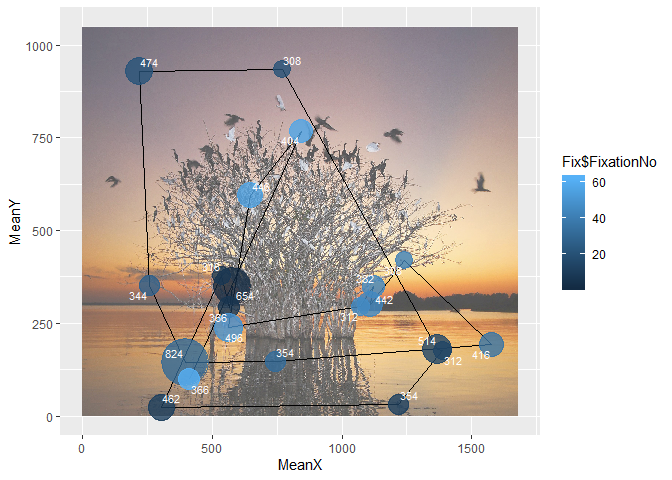
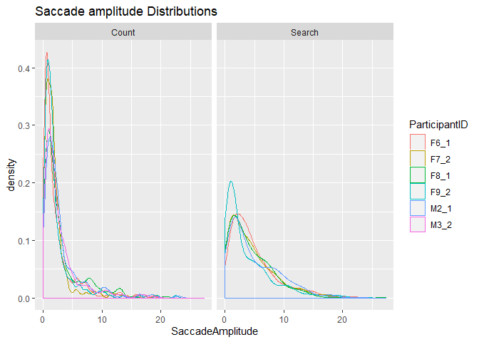
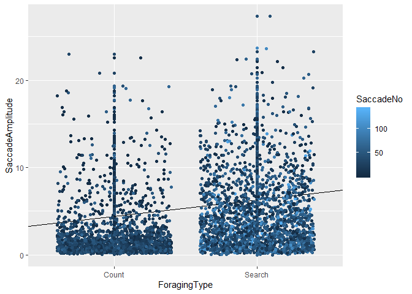
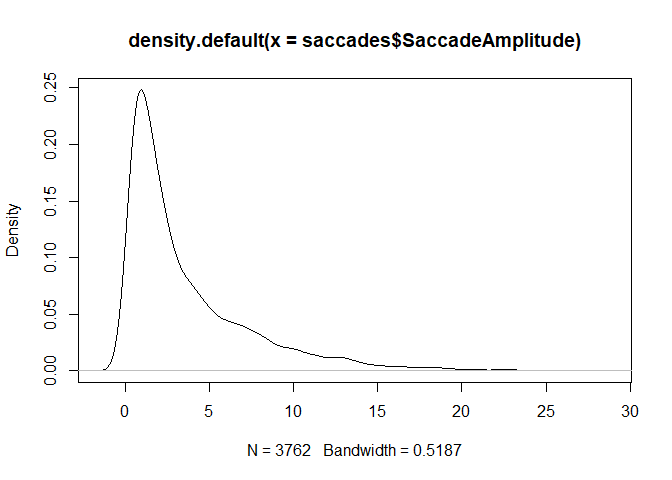
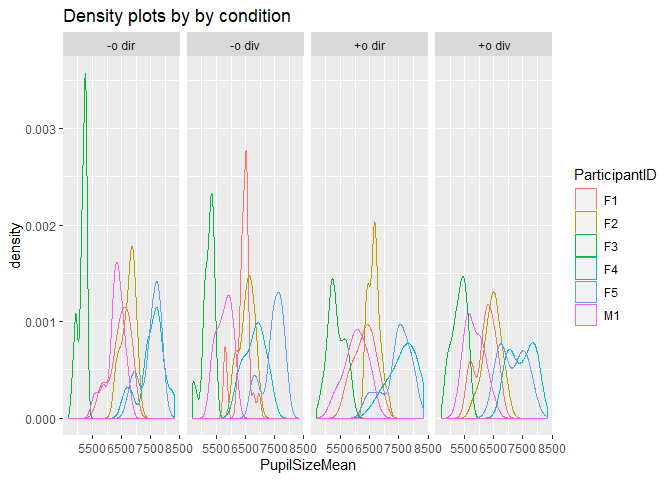
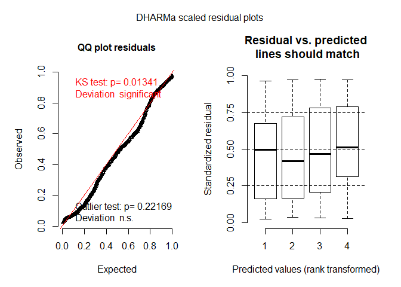

CompMod1
================
Peter
18/2/2020

``` r
pacman::p_load(tidyverse,lmerTest,ggrepel,ggExtra, Hmisc,DHARMa,MuMIn)


samples <- read_csv("Exported_EyeLink_data/Samples_merged.csv",col_types= cols( ParticipantID = col_character(),

ParticipantGender = col_character(),

EyeTracked = col_character(),

Task = col_character(),

SearchOrder = col_double(),

ForagingType = col_character(),

Trial = col_double(),

Stimulus = col_character(),

Video = col_character(),

Time = col_double(),

GazeX = col_double(),

GazeY = col_double(),

PupilSize = col_double(),

FixationNo = col_double(),

Fix_StartTime = col_double(),

Fix_EndTime = col_double(),

Fix_Duration = col_double(),

Fix_MeanX = col_double(),

Fix_MeanY = col_double(),

Fix_MeanPupilSize = col_double(),

SaccadeNo = col_double(),

Sac_StartTime = col_double(),

Sac_EndTime = col_double(),

Sac_Duration = col_double(),

Sac_StartX = col_double(),

Sac_StartY = col_double(),

Sac_EndX = col_double(),

Sac_EndY = col_double(),

Sac_PeakVelocity = col_double(),

Sac_MeanVelocity = col_double(),

Sac_Blink = col_logical(),

Sac_Direction = col_character(),

Sac_Amplitude = col_double())) %>% 
  mutate(GazeY = 1051-GazeY, Fix_MeanY = 1051-Fix_MeanY) %>% 
  filter(Time<=41202)
```

``` r
unique(samples$ParticipantID)
```

    ##  [1] "F7_2" "M2_1" "M3_2" "F9_2" "F8_1" "F6_1" "F1"   "M1"   "F2"   "F3"  
    ## [11] "F4"   "F5"

``` r
x = subset(samples, ParticipantID ==    'M2_1' & Trial == 5)

filter(samples, ParticipantID == "M2_1" & Trial == 5)
```

    ## # A tibble: 10,590 x 33
    ##    ParticipantID ParticipantGend~ EyeTracked Task  SearchOrder ForagingType
    ##    <chr>         <chr>            <chr>      <chr>       <dbl> <chr>       
    ##  1 M2_1          Male             Left       Fora~           1 Search      
    ##  2 M2_1          Male             Left       Fora~           1 Search      
    ##  3 M2_1          Male             Left       Fora~           1 Search      
    ##  4 M2_1          Male             Left       Fora~           1 Search      
    ##  5 M2_1          Male             Left       Fora~           1 Search      
    ##  6 M2_1          Male             Left       Fora~           1 Search      
    ##  7 M2_1          Male             Left       Fora~           1 Search      
    ##  8 M2_1          Male             Left       Fora~           1 Search      
    ##  9 M2_1          Male             Left       Fora~           1 Search      
    ## 10 M2_1          Male             Left       Fora~           1 Search      
    ## # ... with 10,580 more rows, and 27 more variables: Trial <dbl>,
    ## #   Stimulus <chr>, Video <chr>, Time <dbl>, GazeX <dbl>, GazeY <dbl>,
    ## #   PupilSize <dbl>, FixationNo <dbl>, Fix_StartTime <dbl>, Fix_EndTime <dbl>,
    ## #   Fix_Duration <dbl>, Fix_MeanX <dbl>, Fix_MeanY <dbl>,
    ## #   Fix_MeanPupilSize <dbl>, SaccadeNo <dbl>, Sac_StartTime <dbl>,
    ## #   Sac_EndTime <dbl>, Sac_Duration <dbl>, Sac_StartX <dbl>, Sac_StartY <dbl>,
    ## #   Sac_EndX <dbl>, Sac_EndY <dbl>, Sac_PeakVelocity <dbl>,
    ## #   Sac_MeanVelocity <dbl>, Sac_Blink <lgl>, Sac_Direction <chr>,
    ## #   Sac_Amplitude <dbl>

``` r
## Let's make a summary dataset
Fix <- x[!is.na(x$FixationNo),] %>% 
  group_by(FixationNo) %>% # since I only have one participant and one trial
  summarise(MeanX = Fix_MeanX[1], MeanY = Fix_MeanY[1], Duration = Fix_Duration[1]) %>% 
  filter(Duration>=300) # only keep fixations > 300 ms

img <- jpeg::readJPEG('stimuli_Foraging/birds.jpg')  
img <- grid::rasterGrob(img, width=unit(1, "npc"), height = unit(1,"npc"),
                        interpolate = FALSE)

ggplot(Fix, aes(MeanX, MeanY, color = Fix$FixationNo)) + 
  annotation_custom(img, xmin = 0, xmax = 1680, ymin = 0, ymax = 1050) +
  # hacky way to adjust opacity of background picture:
  annotate(geom = "rect", xmin = 0, xmax = 1680, ymin = 0, ymax = 1050, fill = "white", alpha = .3) +
  geom_path(color = "black") +
  geom_point(size = Fix$Duration*.02, alpha = .8) +
  geom_text_repel(aes(label = Fix$Duration), size = 3, color = "white") +
  xlim(0,1680) + ylim(0,1050)
```

<!-- -->

``` r
saccades <- samples[!is.na(samples$SaccadeNo) & samples$Task == "Foraging",] %>% 
  group_by(ParticipantID, Trial, SaccadeNo) %>% 
  summarise(SaccadeAmplitude = mean(Sac_Amplitude), ForagingType = ForagingType[1], Stimulus = Stimulus[1]) %>% 
  filter(!is.na(SaccadeAmplitude))

head(saccades)
```

    ## # A tibble: 6 x 6
    ## # Groups:   ParticipantID, Trial [1]
    ##   ParticipantID Trial SaccadeNo SaccadeAmplitude ForagingType Stimulus 
    ##   <chr>         <dbl>     <dbl>            <dbl> <chr>        <chr>    
    ## 1 F6_1              1         1             5.54 Search       sheep.jpg
    ## 2 F6_1              1         2             4.02 Search       sheep.jpg
    ## 3 F6_1              1         3            10.6  Search       sheep.jpg
    ## 4 F6_1              1         4             4.29 Search       sheep.jpg
    ## 5 F6_1              1         5             0.45 Search       sheep.jpg
    ## 6 F6_1              1         6            21.4  Search       sheep.jpg

``` r
ggplot(saccades, aes(SaccadeAmplitude, color = ForagingType)) + geom_density()
```

<!-- -->

``` r
mGaus <-
  glmer(
    SaccadeAmplitude ~ ForagingType + (1 + ForagingType |
                                         ParticipantID) + (1 + ForagingType | Stimulus),
    family = gaussian(link = "identity"),
    data = saccades
  )
```

    ## Warning in glmer(SaccadeAmplitude ~ ForagingType + (1 + ForagingType |
    ## ParticipantID) + : calling glmer() with family=gaussian (identity link) as a
    ## shortcut to lmer() is deprecated; please call lmer() directly

``` r
mLog <-
  glmer(
    SaccadeAmplitude ~ ForagingType + (1 + ForagingType |
                                         ParticipantID) + (1 + ForagingType | Stimulus),
    family = gaussian(link = "log"),
    data = saccades
  )
```

    ## boundary (singular) fit: see ?isSingular

``` r
summary(mGaus)
```

    ## Linear mixed model fit by REML ['lmerMod']
    ## Formula: 
    ## SaccadeAmplitude ~ ForagingType + (1 + ForagingType | ParticipantID) +  
    ##     (1 + ForagingType | Stimulus)
    ##    Data: saccades
    ## 
    ## REML criterion at convergence: 20364.2
    ## 
    ## Scaled residuals: 
    ##     Min      1Q  Median      3Q     Max 
    ## -1.5220 -0.6237 -0.2889  0.3112  6.1997 
    ## 
    ## Random effects:
    ##  Groups        Name               Variance Std.Dev. Corr 
    ##  Stimulus      (Intercept)         0.2151  0.4638        
    ##                ForagingTypeSearch  0.7719  0.8786   -0.60
    ##  ParticipantID (Intercept)         0.1318  0.3631        
    ##                ForagingTypeSearch  0.2913  0.5397   -0.61
    ##  Residual                         12.9688  3.6012        
    ## Number of obs: 3762, groups:  Stimulus, 10; ParticipantID, 6
    ## 
    ## Fixed effects:
    ##                    Estimate Std. Error t value
    ## (Intercept)          2.5358     0.2274  11.153
    ## ForagingTypeSearch   1.8753     0.3838   4.887
    ## 
    ## Correlation of Fixed Effects:
    ##             (Intr)
    ## FrgngTypSrc -0.601

``` r
summary(mLog)
```

    ## Generalized linear mixed model fit by maximum likelihood (Laplace
    ##   Approximation) [glmerMod]
    ##  Family: gaussian  ( log )
    ## Formula: 
    ## SaccadeAmplitude ~ ForagingType + (1 + ForagingType | ParticipantID) +  
    ##     (1 + ForagingType | Stimulus)
    ##    Data: saccades
    ## 
    ##      AIC      BIC   logLik deviance df.resid 
    ##  20434.4  20490.5 -10208.2  20416.4     3753 
    ## 
    ## Scaled residuals: 
    ##     Min      1Q  Median      3Q     Max 
    ## -1.5870 -0.6024 -0.3034  0.3149  6.2025 
    ## 
    ## Random effects:
    ##  Groups        Name               Variance Std.Dev. Corr
    ##  Stimulus      (Intercept)         0.0000  0.0000       
    ##                ForagingTypeSearch  0.3844  0.6200    NaN
    ##  ParticipantID (Intercept)         0.0000  0.0000       
    ##                ForagingTypeSearch  0.1257  0.3545    NaN
    ##  Residual                         13.0516  3.6127       
    ## Number of obs: 3762, groups:  Stimulus, 10; ParticipantID, 6
    ## 
    ## Fixed effects:
    ##                    Estimate Std. Error t value Pr(>|z|)    
    ## (Intercept)         0.92669    0.03553  26.082  < 2e-16 ***
    ## ForagingTypeSearch  0.53761    0.07907   6.799 1.05e-11 ***
    ## ---
    ## Signif. codes:  0 '***' 0.001 '**' 0.01 '*' 0.05 '.' 0.1 ' ' 1
    ## 
    ## Correlation of Fixed Effects:
    ##             (Intr)
    ## FrgngTypSrc -0.449
    ## convergence code: 0
    ## boundary (singular) fit: see ?isSingular

``` r
pm1 <- predict(mGaus)
pm2 <- predict(mLog)

plot(density(pm1))
```

<!-- -->

``` r
plot(density(saccades$SaccadeAmplitude))
```

<!-- -->

``` r
#Isolating the Social Engagement Data
pupilSize <- samples %>% 
  filter(Task== "SocialEngagement"& !is.na(PupilSize)&!is.na(Fix_MeanPupilSize))

#parsing conditions from video titles
pupilSize$VideoGender <- pupilSize$Video %>% str_extract("f|m")
pupilSize$VideoOstension <- pupilSize$Video %>% str_extract("\\+o|\\-o")
pupilSize$VideoDirection <- pupilSize$Video %>% str_extract("dir|div")
pupilSize$VideoCondition<-paste(pupilSize$VideoOstension,pupilSize$VideoDirection)
#Grouping by ID, Trial, FixNo and getting a single mean, and conditions tatuses
pupilModelData<- pupilSize %>% 
  group_by(ParticipantID, Trial,FixationNo) %>% 
  summarise(PupilSizeMean = mean(Fix_MeanPupilSize), Video = Video[1],Direction= VideoDirection[1],Ostension=VideoOstension[1],Condition=VideoCondition[1])

#density plot
ggplot(pupilModelData, aes(PupilSizeMean, color = ParticipantID)) + geom_density()+ facet_wrap( ~ Condition, ncol=4)+ ggtitle("Density plots by by condition")
```

<!-- -->

``` r
#model
pupilModel<- lmer(
    PupilSizeMean ~ 1 + Direction*Ostension+ 
      (1 + Direction*Ostension|ParticipantID),data=pupilModelData)
```

    ## boundary (singular) fit: see ?isSingular

``` r
pupilModelColons<- lmer(
    PupilSizeMean ~ 1 + Direction:Ostension+ 
      (1 + Direction:Ostension|ParticipantID),data=pupilModelData)
```

    ## fixed-effect model matrix is rank deficient so dropping 1 column / coefficient

    ## Warning in checkConv(attr(opt, "derivs"), opt$par, ctrl = control$checkConv, :
    ## unable to evaluate scaled gradient

    ## Warning in checkConv(attr(opt, "derivs"), opt$par, ctrl = control$checkConv, :
    ## Model failed to converge: degenerate Hessian with 1 negative eigenvalues

    ## Warning: Model failed to converge with 2 negative eigenvalues: -1.4e-06 -9.4e-04

``` r
summary(pupilModel)
```

    ## Linear mixed model fit by REML. t-tests use Satterthwaite's method [
    ## lmerModLmerTest]
    ## Formula: PupilSizeMean ~ 1 + Direction * Ostension + (1 + Direction *  
    ##     Ostension | ParticipantID)
    ##    Data: pupilModelData
    ## 
    ## REML criterion at convergence: 7972.4
    ## 
    ## Scaled residuals: 
    ##     Min      1Q  Median      3Q     Max 
    ## -3.1675 -0.5510  0.1476  0.6526  2.2700 
    ## 
    ## Random effects:
    ##  Groups        Name                     Variance Std.Dev. Corr             
    ##  ParticipantID (Intercept)              778665   882.4                     
    ##                Directiondiv              89339   298.9    -0.49            
    ##                Ostension+o               21866   147.9    -0.26  0.16      
    ##                Directiondiv:Ostension+o  83685   289.3     0.29 -0.97 -0.01
    ##  Residual                               109673   331.2                     
    ## Number of obs: 551, groups:  ParticipantID, 6
    ## 
    ## Fixed effects:
    ##                          Estimate Std. Error       df t value Pr(>|t|)    
    ## (Intercept)              6613.907    361.261    5.020  18.308 8.64e-06 ***
    ## Directiondiv             -250.294    127.999    5.009  -1.955    0.108    
    ## Ostension+o               -47.054     72.377    5.294  -0.650    0.543    
    ## Directiondiv:Ostension+o   92.703    131.232    5.147   0.706    0.511    
    ## ---
    ## Signif. codes:  0 '***' 0.001 '**' 0.01 '*' 0.05 '.' 0.1 ' ' 1
    ## 
    ## Correlation of Fixed Effects:
    ##             (Intr) Drctnd Ostns+
    ## Directiondv -0.484              
    ## Ostension+o -0.240  0.203       
    ## Drctndv:Os+  0.277 -0.922 -0.172
    ## convergence code: 0
    ## boundary (singular) fit: see ?isSingular

``` r
#plotting residuals
pupilSim <- simulateResiduals(pupilModel, n = 250)
```

    ## Warning in checkModel(fittedModel): DHARMa: fittedModel not in class of
    ## supported models. Absolutely no guarantee that this will work!

    ## Model family was recognized or set as continuous, but duplicate values were detected in the response. Consider if you are fitting an appropriate model.

``` r
plot(pupilSim )
```

<!-- -->

``` r
r.squaredGLMM(pupilModel)
```

    ## Warning: 'r.squaredGLMM' now calculates a revised statistic. See the help page.

    ##             R2m       R2c
    ## [1,] 0.01399353 0.8652069

``` r
unique(pupilSize$ParticipantID)
```

    ## [1] "F1" "M1" "F2" "F3" "F4" "F5"

``` r
pupilGuy = subset(pupilSize, ParticipantID ==    'M1' & Trial == 1)


## Let's make a summary dataset
pupilFix <- pupilGuy[!is.na(pupilGuy$FixationNo),] %>% 
  group_by(FixationNo) %>% # since I only have one participant and one trial
  summarise(MeanX = Fix_MeanX[1], MeanY = Fix_MeanY[1], Duration = Fix_Duration[1]) %>% 
  filter(Duration>=300) # only keep fixations > 300 ms

#scanpath plot #BORING...
ggplot(pupilFix, aes(MeanX, MeanY, color = pupilFix$FixationNo)) +
  geom_path(color = "black") +
  geom_point(size = pupilFix$Duration*.01, alpha = .5) +
  geom_text_repel(aes(label = pupilFix$Duration), size = 3, color = "white") +
  xlim(0,1680) + ylim(0,1050)
```

<!-- -->

``` r
#data for plots
pupilModelData2 <- pupilModelData %>% 
  group_by(Ostension, Direction) %>% 
  summarise(PupilSizeMean = mean(PupilSizeMean))

#line plot for interaction
pupilModelData2%>% 
  ggplot(aes(x = Ostension, 
             y = PupilSizeMean, 
             color = Direction)) +
  geom_line(aes(group = Direction)) +
  geom_point()+
  ggtitle("Interaction effect in linear model")
```

<!-- -->

``` r
#bar plot
pupilModelData %>% ggplot(
       aes(x = Ostension,
           fill = Direction,  
           y = PupilSizeMean)) +
  stat_summary(fun.y = mean,
               geom = "bar") +
  stat_summary(fun.data = mean_cl_normal, 
               geom="errorbar", 
               width = 0.25)+
  facet_wrap(~Direction)+
  labs(x = "Ostension",
       y = "Pupil Size") +
  theme_minimal() +
  scale_fill_brewer(palette = "Blues") +
  theme(legend.position="none")+
  ggtitle("2X2 Bar plot")
```

<!-- -->

``` r
#bar plot for individuals
pupilModelData %>% ggplot(
       aes(x = ParticipantID,
           fill = ParticipantID,  
           y = PupilSizeMean)) +
  stat_summary(fun.y = mean,
               geom = "bar") +
  stat_summary(fun.data = mean_cl_normal, 
               geom="errorbar", 
               width = 0.25)+
  facet_wrap(~Condition)+
  labs(x = "Participant",
       y = "Pupil Size") +
  ggtitle("2X2 Bar plot by participant")
```

<!-- -->

``` r
#box plots for individuals
ggplot(pupilModelData, aes(x = ParticipantID, y = PupilSizeMean, fill = ParticipantID)) + 
    geom_boxplot()+facet_wrap(~Condition)+
  ggtitle("Effect for the indivudal Participant")
```

<!-- -->

``` r
#box plots for conditions
ggplot(pupilModelData, aes(x = Condition, y = PupilSizeMean, fill = Condition)) + 
    geom_boxplot()+
  ggtitle("Boxplot on conditions")
```

<!-- -->

``` r
#Growth curves between conditions
ggplot(pupilSize, aes(Time, PupilSize, color = VideoCondition)) +
  geom_smooth()+
  ggtitle("Growth curves between conditions")
```

    ## `geom_smooth()` using method = 'gam' and formula 'y ~ s(x, bs = "cs")'

<!-- -->

``` r
#Growth curves between conditions
ggplot(pupilSize, aes(Time, PupilSize, color = ParticipantID)) +
  geom_smooth()+facet_wrap(~VideoCondition)+
  ggtitle("Growth curves between conditions for every single partipant")
```

    ## `geom_smooth()` using method = 'gam' and formula 'y ~ s(x, bs = "cs")'

<!-- -->
